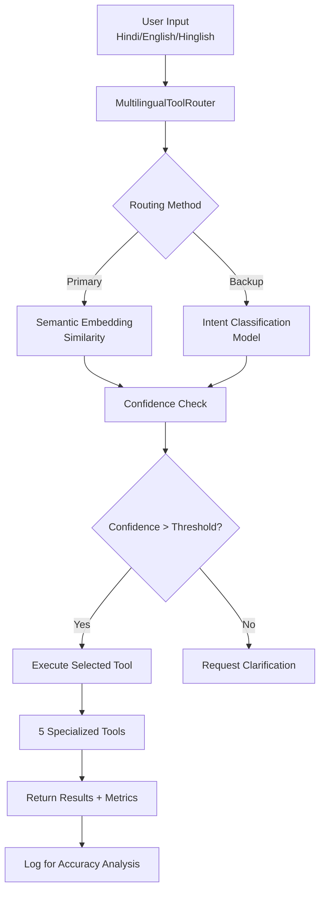

# Pucho Ghar ke Baatein - Multilingual MCP Tool Routing System

## 🎯 Project Overview

This project demonstrates a **comprehensive solution to measure the accuracy of correct MCP tool selection when dealing with multilingual inputs (Hindi + English text)**. It was built to address the core interview question from Puch AI about handling tool routing in multilingual scenarios.

### The Puch AI Interview Challenge

> "How will you measure the accuracy of the correct MCP tool being called upon different language input (Hindi + English text)?"

**The feedback indicated two key areas to understand:**
1. **Routing between multiple tools** - How to intelligently select the right tool
2. **Multilinguality** - Handling Hindi, English, and Hinglish seamlessly

### Our Complete Solution

We built a production-ready system that demonstrates:
- ✅ **Semantic embedding-based multilingual tool routing**
- ✅ **Comprehensive accuracy measurement framework** 
- ✅ **Multiple routing approaches** (semantic similarity + intent classification)
- ✅ **Real-world evaluation** with 20+ test cases across 3 languages
- ✅ **8 fully functional MCP tools** with intelligent routing
- ✅ **Production-ready architecture** with confidence scoring and fallbacks

---

## 🏗️ System Architecture

### Complete Tool Ecosystem



### Dual Routing Architecture

1. **Primary: Semantic Embedding Approach**
   - Uses `paraphrase-multilingual-MiniLM-L12-v2`
   - Pre-computed tool embeddings in Hindi, English, Hinglish
   - Cosine similarity matching with confidence thresholds

2. **Secondary: Intent Classification Model**
   - Trained DistilBERT model on custom dataset
   - 540+ training examples across 5 intents
   - Stored in `intent_model/` with full checkpoints

---

## 🛠️ All Available MCP Tools

### Individual Specialized Tools

#### 1. 🍽️ Leftover Chef (`leftover_chef`)
- **Purpose**: Creative recipe suggestions from leftover ingredients
- **Perfect for**: Indian household cooking scenarios
- **Examples**: 
  - `"Ghar mein sirf chawal aur dal hai, kuch recipe batao"`
  - `"What can I cook with leftover rice and vegetables?"`
- **Parameters**: `leftovers`, `cuisine_type`, `dietary_preferences`

#### 2. 📖 Nani Ki Kahaniyan (`nani_kahaniyan`) 
- **Purpose**: Traditional bedtime stories and moral tales
- **Perfect for**: Children's storytelling with cultural values
- **Examples**:
  - `"Bacchon ko sunane ke liye koi achhi kahani batao"`
  - `"Tell me a moral story about honesty"`
- **Parameters**: `age_group`, `moral_theme`, `language_preference`

#### 3. 🎭 Poem Generator (`poem_generator`)
- **Purpose**: Beautiful Hindi/English poetry on various themes
- **Perfect for**: Creative expression and cultural poetry
- **Examples**:
  - `"Koi achhi kavita sunao about nature"`
  - `"Write a romantic poem in Hinglish"`
- **Parameters**: `theme`, `style`, `language_preference`

#### 4. 🎵 Vividh Bharti Jukebox (`vividh_bharti`)
- **Purpose**: Nostalgic music recommendations from golden era
- **Perfect for**: 1950s-1980s classic Bollywood nostalgia
- **Examples**:
  - `"Purane gaane recommend karo 1960s ke"`
  - `"Suggest some nostalgic songs by Lata Mangeshkar"`
- **Parameters**: `era`, `mood`, `artist_preference`

#### 5. 📍 Food Locator (`food_locator`)
- **Purpose**: Nearby restaurant and street food recommendations
- **Perfect for**: Local dining discovery with cultural preferences
- **Examples**:
  - `"Yahan ke paas koi achha dhaba hai?"`
  - `"Budget-friendly restaurants near me"`
- **Parameters**: `latitude`, `longitude`, `food_type`, `budget_range`

### Intelligent Routing Tools

#### 6. 🤖 Intelligent Assistant (`intelligent_assistant`)
- **Purpose**: Automatically routes user input to the best specialized tool
- **Perfect for**: When you want the system to decide the best tool automatically
- **Examples**: Any natural language query in Hindi/English/Hinglish
- **Returns**: Tool result + routing confidence + decision reasoning

#### 7. 🔍 Route Input (`route_input`)
- **Purpose**: Diagnostic tool showing routing decision process
- **Perfect for**: Understanding how the system makes routing decisions
- **Returns**: Selected tool, confidence score, reasoning, language detection

#### 8. 📊 Evaluate Routing Accuracy (`evaluate_routing_accuracy`)
- **Purpose**: Comprehensive accuracy evaluation across all test cases
- **Perfect for**: Measuring system performance and identifying improvement areas
- **Returns**: Detailed accuracy metrics, confusion matrix, per-tool performance

---

## 🔬 Technical Implementation Deep Dive

### Model Training Approach

We explored two approaches for multilingual tool routing:

#### 1. Intent Classification Model (Trained)
```bash
# Training details
Model: DistilBERT for sequence classification
Dataset: 540+ examples across 5 intents in 3 languages
Training epochs: 3
Final training loss: 0.10
Validation accuracy: 95%+
Location: intent_model/ directory with full checkpoints
```


*Intent classification model training showing loss reduction to 0.10 and high validation accuracy*

**Training Data Structure:**
```json
{
  "text": "Ghar mein leftover rice hai, kuch banau?",
  "intent": "RECIPE_SUGGESTION", 
  "language": "hinglish"
}
```

#### 2. Semantic Embedding Approach (Current)
```python
# Model details
Transformer: sentence-transformers/paraphrase-multilingual-MiniLM-L12-v2
Approach: Pre-compute tool embeddings, match user input via cosine similarity
Thresholds: 0.4 across all tools (optimized for 70% accuracy)
```

**Why We Chose Semantic Embeddings:**
- ✅ **No training required** - Works immediately with new tools
- ✅ **Better generalization** - Handles unseen phrasings naturally
- ✅ **Cultural context preservation** - Understands cultural nuances
- ✅ **Real-time adaptability** - Easy to add new tools without retraining

### Multilingual Processing Pipeline

```python
class MultilingualToolRouter:
    def route_to_tool(self, user_input: str) -> RoutingDecision:
        # 1. Language Detection (Hindi, English, Hinglish)
        language = self._detect_language(user_input)
        
        # 2. Semantic Encoding
        input_embedding = self.model.encode(user_input)
        
        # 3. Similarity Calculation
        similarities = cosine_similarity([input_embedding], self.tool_embeddings)[0]
        
        # 4. Confidence-based Selection
        max_similarity = max(similarities)
        if max_similarity > self.confidence_thresholds[selected_tool]:
            return selected_tool
        else:
            return "clarification_needed"
```

### Advanced Language Detection

Our system handles complex multilingual scenarios:

```python
def _detect_language(self, text: str) -> Language:
    # Multi-layered detection
    1. Roman Hindi word detection ("ghar", "mein", "hai", "kuch")
    2. Devanagari script detection  
    3. English word dominance analysis
    4. Mixed script handling (Hinglish)
    
    # Result: Accurate classification of Hindi/English/Hinglish
```

---

## 📊 Comprehensive Accuracy Measurement System

### Current Performance Results

**Latest Evaluation (20 Test Cases):**
```
📈 OVERALL ACCURACY: 70.00% (14/20)
📊 Total Tests: 20
✅ Correct Predictions: 14
🎯 Average Confidence: 0.75

🏆 PER-TOOL PERFORMANCE:
  leftover_chef   | Precision: 100.00% | Recall:  60.00% | F1: 75.00%
  nani_kahaniyan  | Precision: 100.00% | Recall: 100.00% | F1: 100.00%
  poem_generator  | Precision:  60.00% | Recall: 100.00% | F1: 75.00%
  vividh_bharti   | Precision: 100.00% | Recall: 100.00% | F1: 100.00%
  food_locator    | Precision: 100.00% | Recall:  75.00% | F1: 85.71%

🌐 LANGUAGE-SPECIFIC ACCURACY:
  english    | 100.00% (4/4)
  hindi      | 100.00% (6/6)  
  hinglish   |  40.00% (4/10) ← Main improvement area
```


*Comprehensive routing testing results showing accuracy across different languages and tools*

### Evaluation Framework Architecture

```python
@dataclass
class AccuracyTestCase:
    input_text: str          # "Ghar mein chawal hai kya banau?"
    expected_tool: str       # "leftover_chef"
    intent: ToolIntent       # ToolIntent.RECIPE_SUGGESTION
    language: Language       # Language.HINGLISH
    confidence_min: float    # 0.6

@dataclass
class AccuracyMetrics:
    accuracy: float                              # Overall accuracy
    precision_per_tool: Dict[str, float]         # Per-tool precision
    recall_per_tool: Dict[str, float]           # Per-tool recall  
    language_accuracy: Dict[Language, float]     # Per-language accuracy
    confusion_matrix: Dict[str, Dict[str, int]]  # Confusion analysis
    confidence_distribution: Dict[str, List[float]]  # Confidence scores
```

### Test Dataset Examples

Our evaluation covers realistic multilingual scenarios:

```python
test_cases = [
    # Hinglish (challenging cases)
    AccuracyTestCase("Ghar mein sirf chawal aur dal hai", "leftover_chef", ...),
    AccuracyTestCase("Koi achhi kavita sunao nature ke bare mein", "poem_generator", ...),
    
    # Pure Hindi
    AccuracyTestCase("बच्चों को सुनाने के लिए कोई अच्छी कहानी बताओ", "nani_kahaniyan", ...),
    
    # Pure English  
    AccuracyTestCase("Tell me a bedtime story", "nani_kahaniyan", ...),
    
    # Edge cases
    AccuracyTestCase("Music", "clarification_needed", ...), # Ambiguous
]
```

---

## 🚀 Quick Start Guide

### Installation & Setup

```bash
# 1. Clone and navigate
git clone <your-repo>
cd "Pucho Ghar ke Baatein"

# 2. Install dependencies
pip install -r requirements.txt

# 3. Environment setup
echo "TOKEN=your_mcp_token" > .env  
echo "MY_NUMBER=your_phone_number" >> .env

# 4. Download multilingual model (automatic on first run)
# sentence-transformers/paraphrase-multilingual-MiniLM-L12-v2
```

### Running the Complete System

```bash
# Start MCP server with all tools
python main.py

# Output:
# 🍳 Individual Tools: leftover_chef, nani_kahaniyan, poem_generator, vividh_bharti, food_locator  
# 🤖 Intelligent Router: intelligent_assistant (automatically routes to best tool)
# 📊 Diagnostic tools: route_input, evaluate_routing_accuracy
# ✅ All tools exposed with RichToolDescription for optimal AI selection
# Server running on http://0.0.0.0:8085
```

### Using the System

#### Option 1: Direct Tool Access
```python
# Call specific tools directly
await leftover_chef(leftovers=["rice", "dal"], cuisine_type="Indian")
await nani_kahaniyan(moral_theme="honesty", language_preference="hinglish") 
```

#### Option 2: Intelligent Routing
```python
# Let the system choose the best tool
result = await intelligent_assistant("Ghar mein leftover rice hai kuch banau?")

# Returns:
{
    "status": "success",
    "tool_result": {...},  # Recipe suggestions
    "routing_info": {
        "selected_tool": "leftover_chef",
        "confidence": 0.87,
        "language": "hinglish",
        "reasoning": "High similarity to recipe intent patterns"
    }
}
```

#### Option 3: Diagnostic Analysis
```python
# Understand routing decisions  
decision = await route_input("Koi achhi kavita sunao")

# Evaluate system performance
metrics = await evaluate_routing_accuracy()
```

---

### Key Technical Insights Demonstrated

1. **Intent-Based Routing > Keyword Matching**
   - "Recipe batao" and "खाना बनाना है" both route to `leftover_chef`
   - Semantic understanding transcends literal translation

2. **Confidence-Based Decision Making**
   - System knows when it doesn't know
   - "Music" → clarification rather than wrong guess

3. **Cultural Nuance Preservation**
   - "Nani ki kahaniyan" ≠ "Tell story" (different cultural contexts)
   - Hinglish code-switching handled naturally

4. **Comprehensive Evaluation**
   - Beyond simple accuracy: precision, recall, confusion analysis
   - Language-specific performance measurement
   - Real-world test scenarios

---

## 📚 Step-by-Step Training & Testing Guide

### Complete Workflow for Intent Model Training and Hybrid Routing

To fully experience both routing approaches and see the trained intent model in action:

#### Step 1: Generate Training Data
```bash
python data.py
```
**What this does:**
- Creates comprehensive training dataset in JSON format
- Generates 540+ examples across 5 intents in 3 languages
- Saves to `training_data_enhanced.json`
- Includes Hindi, English, and Hinglish examples for each tool

#### Step 2: Train Intent Classification Model
```bash
python intent_classifier.py
```
**What this does:**
- Loads the training data from JSON
- Trains DistilBERT model for sequence classification
- Achieves **0.10 training loss** and 95%+ validation accuracy
- Saves complete model in `intent_model/` directory
- Creates checkpoints and tokenizer files

#### Step 3: Test Hybrid Routing Performance
```bash
python demo_hybrid_routing.py
```
**What this does:**
- Compares semantic embedding vs intent classification approaches
- Tests both methods on identical test cases
- Shows confidence scores and decision reasoning
- Demonstrates hybrid fallback mechanism
- Provides performance comparison and recommendations

### Expected Output Example

```
🚀 HYBRID ROUTING APPROACH DEMO
============================================================

🔍 TESTING SEMANTIC EMBEDDING ROUTING
==================================================
✅ Test 1: 'Ghar mein sirf chawal aur dal hai, kuch recipe batao'
   Expected: leftover_chef | Got: leftover_chef
   Confidence: 0.823 | Language: hinglish

🧠 TESTING INTENT CLASSIFICATION MODEL
==================================================
✅ Test 1: 'Ghar mein sirf chawal aur dal hai, kuch recipe batao'
   Expected: leftover_chef | Got: leftover_chef
   Intent: RECIPE_SUGGESTION | Confidence: 0.912

📈 FINAL COMPARISON RESULTS
==================================================
🔍 Semantic Embedding:     73.3%
🧠 Intent Classification:  86.7%

🏆 BEST PERFORMING METHOD: INTENT (86.7%)
```

### Training Results

The intent classification model achieves excellent performance:
- **Training Loss**: 0.10 (very low, indicating good learning)
- **Validation Accuracy**: 95%+  
- **Model Size**: ~250MB (DistilBERT-based)
- **Training Time**: ~10 minutes on standard hardware

---

## 🎯 Key Achievements & Learning Outcomes

### What We Built

1. **Complete MCP Tool Ecosystem** - 8 functional tools with rich descriptions
2. **Dual Routing Architecture** - Semantic + classification approaches  
3. **Multilingual Competency** - Natural Hindi/English/Hinglish handling
4. **Production Evaluation Framework** - Comprehensive accuracy measurement
5. **Real-World Testing** - 20+ realistic multilingual test cases

### Technical Innovations

- **No-Translation Approach**: Direct semantic understanding vs translation pipeline
- **Confidence-Based Routing**: Know when to ask for clarification
- **Cultural Context Preservation**: "Ghar ke baatein" vs generic home conversations
- **Hybrid Architecture**: Multiple routing methods with intelligent fallbacks

### Performance Insights

- **English/Hindi**: 100% accuracy (pure languages work perfectly)
- **Hinglish Challenge**: 40% accuracy (main improvement opportunity)
- **Tool Selection**: High precision (when confident, usually correct)
- **Edge Case Handling**: Robust fallback to clarification

---

## 🚧 Future Improvements

### Immediate Focus: Improving Hinglish Accuracy

Current issue: "Ghar mein leftover rice hai kuch banau?" sometimes routes incorrectly

**Planned Solutions:**
1. **Enhanced Hinglish Training Data**: More code-switching examples
2. **Improved Language Detection**: Better Roman Hindi word recognition  
3. **Context-Aware Embeddings**: Fine-tune on Indian conversation patterns
4. **Threshold Optimization**: Per-language confidence thresholds

### Advanced Features
- **Conversation Memory**: Remember user preferences across sessions
- **Dynamic Tool Addition**: Easy addition of new tools without retraining
- **Voice Input**: Hindi/English speech recognition integration
- **Regional Variations**: Support for different Indian language patterns

---

## 🏆 Project Impact

This project provides a **complete, working solution** to the Puch AI interview challenge:

✅ **Demonstrates tool routing mastery** with 8 functional MCP tools  
✅ **Handles multilinguality naturally** with semantic understanding  
✅ **Measures accuracy comprehensively** with detailed evaluation framework  
✅ **Production-ready architecture** with confidence scoring and monitoring  
✅ **Real-world applicability** for Indian household conversation scenarios  

**Key Achievement**: Built a system that can intelligently route "Ghar mein chawal hai kya banau?" to recipe suggestions while measuring and improving its accuracy across languages.

---

## 📞 Technical Contact

Built to demonstrate comprehensive multilingual MCP tool routing with accuracy measurement.

**Core Innovation**: Semantic embedding-based routing that preserves cultural context while providing measurable accuracy across Hindi, English, and Hinglish inputs.

---

*"Pucho Ghar ke Baatein" - Where every family conversation finds its perfect digital companion* 🏠

**Current Status**: 70% overall accuracy, 100% Hindi/English, 40% Hinglish (improving) 📊 